[TOC]

## 尝试搭建一个基于工控板的服务器

> 注: **这里仅展示** 

最终效果
-------------


--------------------

### 01、准备工作

**①mqtt初体验**

​    1、客户端界面 使用 **mqttfx1.7.1** `因为其他版本需要license` 

​	2、服务器使用公用服务器 **然也物联** 

> MQTT 服务器地址： test.ranye-iot.net
> TCP 端口： 1883
>    TCP/TLS 端口： 8883  

**②此时需要`用户名` `密码` `客户端ID`**
`由于个人不想申请个人平台 那我就用公共的`

> 用户名:    test-user
> 密码:      ranye-iot
> 客户端ID:  😒
TODO
**③查看需要主题**

### 02、必坑指南

**①开发板启动ssh服务传输文件** `为什么？` **因为使用filezilla传文件会使文件损坏？？** **什么po工控板**

> 所以只能使用 **scp** 命令了 
>
> 当然这里也是用**putty**连接开发板

### 03、目前前面已完成 主要就是mqtt库移植到arm9开发板 当然这个如何移植呢？(还在找方法呢)

**①知道如何移植 但是cmake文件不知道如何修改**  【记录 今天是2023.11.21】
TODO


### 04、重构了哦(首先实现的是Ubuntu和pc机端)😁

**①pc端开启mqtt服务**

> ①首先要知道安装依赖mqtt依赖openssl否则编译 `mqtt`库时会报错。具体[安装openssl](https://blog.csdn.net/wu10188/article/details/124970453) 然后编译 **`paho.mqtt.c`** 具体编译路径，以及如何安装mqtt库，[请点击](https://blog.csdn.net/thisway_diy/article/details/125557534) 。

**②最后所得到结果是这样的**

**`第一张`** Ubuntu下 客户端

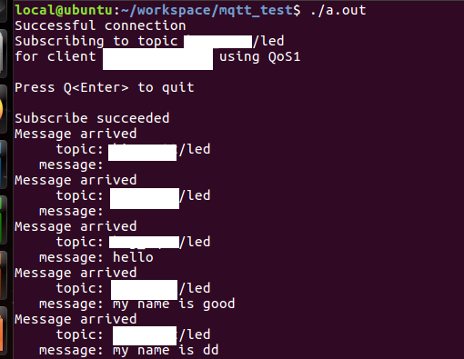

**`第二张`** 服务器端

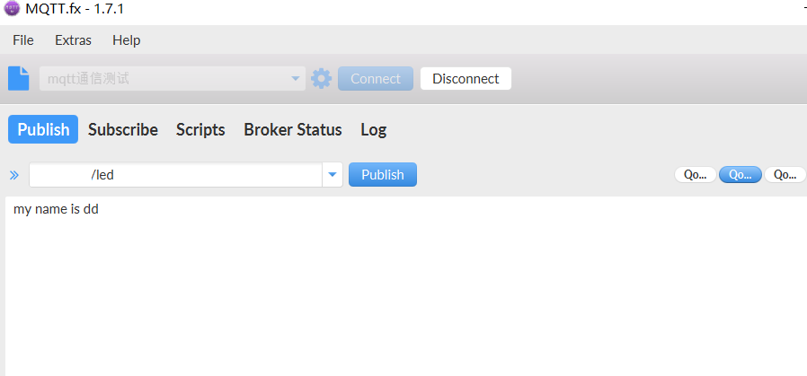

### 05、移植mqtt库到开发板库

**①同时要注意编译交叉编译后的openssl库 [请点击](https://blog.csdn.net/m0_49857167/article/details/128381931)**

> 1、注意交叉编译工具需要移植的`openssl`不然会报错 **找不到库文件 所有`arm-linux-gcc`编译的文件都会缺少文件库**
>
> 2、编译好以后将当前`build/output/`下的所有库放到开发板`/usr/lib/`中

**②终结大问题**

**特别是编译mqtt库时一次编译就够了，重复编译需要删除`.so`这种文件才能编译成功**

### 	06、`mouse`总结移植内容😭

 **完全受不了** `实在是太痛苦了`

**①、【硬核内容】`mqtt库`移植开发板总结**

> ①首先在Ubuntu中移植`MQTT`库
>
> * 首先下载**MQTT**库
>
>   ```C
>   git clone https://github.com/eclipse/paho.mqtt.c.git
>   ```
>
> * 然后在下载好的这个文件夹中`./paho.mqtt.c`进入这个文件夹，在**Ubuntu中**不需要修改这个顶层`Makefile`除非你的路径有变化，执行以下命令。
>
>   ```C
>   make
>   sudo make install
>   ```
>
>   这条指令会将**mqtt程序**依赖的库文件安装到`/usr/local`下的`bin`、`lib`、`include`和`share`下，同时编译出来的库在`./paho.mqtt.c/build/output`中。
>
> * 那么这个时候就可以开始开发了，将`paho.mqtt.c`下的src和sample里面的随意一个示例代码copy过来,这里我是`MQTTAsync_subscribe.c`，但是是需要修改的，因为头文件路径变了。首先是头文件`MQTTAsync.h`，我们需要指定路径，不然在当前目录下是找不到这个头文件的，我们已经将这个头文件所在的官方源文件文件夹`src`copy过来了，所以只需要改成：
>
>   ```C
>   #include "src/MQTTAsync.h"
>   ```
>   * 同时需要修改网关`URL`和`CLIENTID`以及订阅的`TOPIC`，还要添加联网平台设备的用户名`USERNAME`和密码`PASSWORD`, 平台可选**阿里、百度、等**，这里我选择**然也物联**，以下时原来的参数/需修改。
>
>   ```C
>    32 #define ADDRESS     "tcp://mqtt.eclipseprojects.io:1883"
>    33 #define CLIENTID    "ExampleClientSub"
>    34 #define TOPIC       "MQTT Examples"
>   ```
>
>   * 同时鉴于然也物联平台的要求，我们需要将连接控制包的`keepAliveInterval`设置位**60**，并且对控制包的用户名`username`和密码`password`赋值为我们宏定义的值
>
>     ```C
>     /* void connlost(void *context, char *cause) */ 
>     conn_opts.username = USERNAME;
>     conn_opts.password = PASSWORD;
>     conn_opts.keepAliveInterval = 60;
>     
>     /* int main(int argc, char* argv[]) */
>     conn_opts.username = USERNAME;
>     conn_opts.password = PASSWORD;
>     conn_opts.keepAliveInterval = 60;
>     ```
>
>   * 编译修改号之后的`MQTTAsync_subscribe.c`：
>
>     ```C
>     # gcc MQTTAsync_subscribe.c -lpaho-mqtt3a
>     # ./a.out
>     ```
>
> ① 移植`MQTT`到开发板
>
> * 同理，需要修改顶层**Makefile** 只需修改**编译器选项** 和 依赖库放到**交叉编译器**库文件`/usr/local`下的`bin`、`lib`、`include`和`share`下。我的是->
>
>   * 这是设置prefix，到编译器路径下**将这些路链接到交叉编译器**
>
>   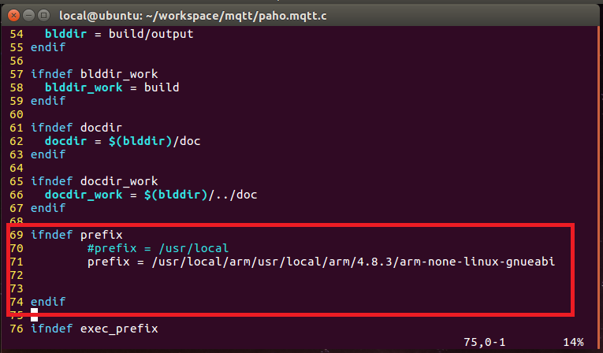
>
>   * 这是设置编译器
>
>   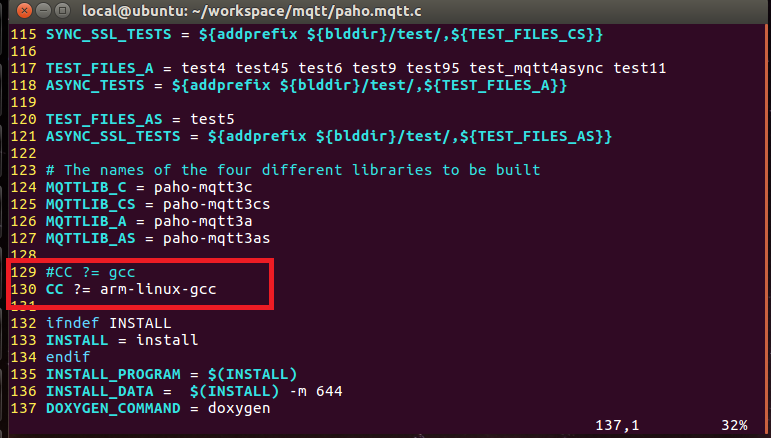
>
> * 在编译这个到arm板的`MQTT`库之前需要安装**openssl库**这个异常重要，也需要 **`交叉编译这个库`** 并且还需要把编译后的`bin`、`lib`、`include`和`share`，移植到**上图交叉编译器的**`bin`、`lib`、`include`和`share`等全部都要移植，参考文档 **`chatGPT`** 输出文档。->
>
>   > 在 Ubuntu 下为交叉编译器安装 OpenSSL，您可以按照以下步骤进行操作：
>   >
>   > 1. 确定 OpenSSL 的版本：首先确定您希望安装的 OpenSSL 版本。您可以选择从源代码编译安装最新版本，或者使用适用于您的交叉编译器的预编译二进制文件。
>   >
>   > 2. 下载 OpenSSL 源代码（可选）：如果您选择从源代码编译安装 OpenSSL，请前往 OpenSSL 的官方网站（https://www.openssl.org/）下载源代码包（tar.gz 格式）。【此源码我是下载前面安装**openssl文章** 提供的。】
>   >
>   > 3. 解压源代码包（如果适用）：如果您下载了源代码包，请使用以下命令解压它：
>   >    ````
>   >    tar -xzf openssl-x.x.x.tar.gz
>   >    ```
>   >    其中 `openssl-x.x.x.tar.gz` 是您下载的源代码包的文件名。
>   >
>   > 4. 进入 OpenSSL 源代码目录：使用以下命令进入解压后的 OpenSSL 源代码目录：
>   >    ````
>   >    cd openssl-x.x.x
>   >    ```
>   >    其中 `openssl-x.x.x` 是解压后的源代码目录名。
>   >
>   > 5. 配置交叉编译环境变量：根据您的交叉编译器路径和目标架构，设置适当的交叉编译环境变量。例如，假设您的交叉编译器路径为 `/usr/local/arm/usr/local/arm/4.8.3/bin/arm-none-linux-gnueabi-gcc`，则可以执行以下命令配置环境变量：
>   >    ````
>   >    export CC=/usr/local/arm/usr/local/arm/4.8.3/bin/arm-none-linux-gnueabi-gcc
>   >    export AR=/usr/local/arm/usr/local/arm/4.8.3/bin/arm-none-linux-gnueabi-ar
>   >    export RANLIB=/usr/local/arm/usr/local/arm/4.8.3/bin/arm-none-linux-gnueabi-ranlib
>   >    ```
>   >    确保将路径替换为您实际的交叉编译器路径。
>   >
>   > 6. 配置 OpenSSL 编译选项：运行以下命令配置 OpenSSL 的编译选项：
>   >    ````
>   >    ./Configure --prefix=/usr/local/openssl -static <target>
>   >    ```
>   >    其中 `<target>` 是您的目标架构，例如 `linux-armv4` 或 `linux-armv7`。特别说明**这里由于我是arm9作用我选择v4架构**。
>   >
>   > 7. 编译和安装 OpenSSL：运行以下命令编译和安装 OpenSSL：
>   >    ````
>   >    make
>   >    sudo make install
>   >    ```
>   >
>   > 8. 完成安装：安装完成后，您将在 `/usr/local/openssl` 目录下找到交叉编译后的 OpenSSL 库和头文件。
>   >
>   > 请注意，上述步骤提供了基本的过程，具体步骤可能会根据您的系统和编译环境有所不同。确保根据实际情况进行调整，并参考 OpenSSL 的文档和说明来获取更多详细信息。
>
> * 到此再去编译`paho.mqtt.c`文件夹下的文件
>
>   ```C
>   make
>   sudo make install
>   ```
>
>   就可以将`./build/output`下的**.so** 等文件打包移植到开发板`/usr/lib`下就可以了

**②【大坑指南】**

> 特别是在使用`make` `sudo make install`时候出现什么`.so `已存在 这就需要去编译目录下将所有的编译文件删除，我这里是`/usr/local/arm/usr/local/arm/4.8.3/arm-none-linux-gnubihf/lib`下去删除所有的**.so**文件，【记住是所有】。然后再去再次编译，才不会出现什么文件**........so** 文件已存在。

TODO

【2023.11.23】

### 07、编程方面 Big_Brainy

* [这是源码，请点击](./src/index.c)

* ①解释`MQTT` 编程的基本函数区别 = ：【说明 这里用的是**同步机制** 的`mqttclient` 】**记得回调函数 在连接服务器函数之前使用** 

  ```C
  /*  paho mqtt基本操作
      我们使用mqtt有如下几个操作：
  
      创建/销毁客户端
      连接/断开连接服务器
      订阅/取消订阅主题
      处理订阅消息
      发布主题消息*/
  	
  //1、客户端句柄：MQTTClient
  // MQTTClient.h
  typedef void* MQTTClient;
  
  // .c文件中定义客户端句柄
  MQTTClient client;
  
  //2、创建客户端函数  如果成功返回MQTTCLIENT_SUCCESS 否则返回错误码
  int MQTTClient_create(MQTTClient* handle, 
                        const char* serverURI, 
                        const char* clientId,
                        int persistence_type, 
                        void* persistence_context)
  
  //3、销毁同步客户端
  void MQTTClient_destroy(MQTTClient* handle)
  
  MQTTClient client;
  MQTTClient_destroy(&client);
  
  //4、回调函数设置
  int MQTTClient_setCallbacks(MQTTClient handle, 
                              void* context, 
                              MQTTClient_connectionLost* cl,
                              MQTTClient_messageArrived* ma, 
                              MQTTClient_deliveryComplete* dc)
  //5、和服务器连接
  LIBMQTT_API int MQTTClient_connect(MQTTClient handle, MQTTClient_connectOptions* options);
  //6、和服务器断开连接
  LIBMQTT_API int MQTTClient_disconnect(MQTTClient handle, int timeout);
  
  
  //7、订阅主题
  LIBMQTT_API int MQTTClient_subscribe(MQTTClient handle, const char* topic, int qos);
  
  //8、发布消息
  LIBMQTT_API int MQTTClient_publishMessage(MQTTClient handle, const char* topicName, 
                                            MQTTClient_message* msg,
                                            MQTTClient_deliveryToken* dt);
  
  ```

* 其实到这里读取`RS485总线`的数据 使用这个**模块化程序**  ，[请点击，源码如下](./src/tty.c)

### 08、发布消息控制对应的控制命令

| 命令 |       对应的控制对象       |
| :--: | :------------------------: |
| down |            关灯            |
|  on  |            开灯            |
| buz  | 蜂鸣器开(开2s后关，太吵了) |

### 09、封装和模块化COM口发送和读取模块

> 注: 这里修改很多的参数-> 包括但不限于波特率 停止位 数据位等 全部都写成了统一的参数 完全封装。【2023.11.25】TODO

* 封装后的**源码 ** [请点击，源码如下](./src/soc.c)

### 10、RS485和modbus协议 通信的从机设备

**【通过pc主机 温湿度传感器从机】** -> 2023.11.26

* ①主要是**主机** `询问` **从机** `应答`方式 【已经能成功接收了】同时发现了一个[CRC校验网站](http://www.ip33.com/crc.html) 只需将modbus发送数据前6个输入 就会自动生成`CRC校验位` 注意这里使用时 这**两位要交换** 。

  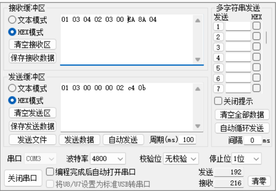

* 在此`遇见`一个问题 **就是为什么将其应用到Linux开发板就不可以接收数据了** 【表示疑惑】同理`有的串口调试助手可以接收到数据 有的不可以` 🤔🤔🤔

  > **猜想： ** 没有正确供电？🤔
  >
  > **器件: ** 这里有用到了**①基于rs485的温湿度传感器**   **②USB转RS485转换器**   **③一个工业arm板**
  >
  > **挖个坑：** 如果你也有`碰到 ` 祝你**好运** 

  

* 开发板可以`读取数据`了

  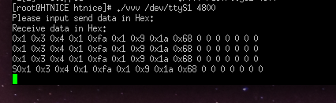

* 重要的`时刻`到了，**数据解析** 

  **发送数据** 

  | 地址 | 功能码 | 起始寄存 器地址高 | 起始寄存 器地址低 | 寄存器 长度高 | 寄存器 长度低 | CRC16 低 | CRC16 高 |
  | :--: | :----: | :---------------: | :---------------: | :-----------: | :-----------: | :------: | :------: |
  | 0X01 |  0X03  |       0X00        |       0X00        |     0X00      |     0X02      |   0XC4   |   0X0B   |

  **接收到的数据解析** 

  | 地址码 | 功能码 | 返回有效 字节数 |  湿度值   |  温度值   | 校验码 低位 | 校验码 高位 |
  | :----: | :----: | :-------------: | :-------: | :-------: | :---------: | :---------: |
  |  0x01  |  0x03  |      0x04       | 0x01 0xE6 | 0x01 0x09 |    0x1B     |    0xA0     |

  **解析公式** 

  >温度计算：
  >当温度低于 0 ℃ 时温度数据以补码的形式上传。
  >温度： 0109 H(十六进制)= 25 => 温度 = 25℃
  >湿度计算：
  >湿度： 1E6 H (十六进制)= 486 => 湿度 = 48.6%RH  

* [展示我封装好的读取com库的函数](./src/ans.c) 【2023.11.26】TODO

  > 注: 这是我封装好的好的函数，也就是你可以通过这个就不用去设置麻烦的一套 RS485的配置，我全部写好了适用于这个传感器的波特率等，若需要配置不同不同的传感器，可以后序修改。我这里☞方便我编程。

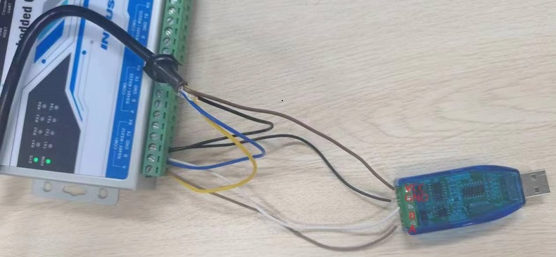

* 振动`传感器`部分【2023.12.1】TODO

  > 注: 这里不同于温度传感器，振动传感器传回来的数据多了**X、Y、Z** 轴这几个数据，后期需要进行  **FFT变换** 得到频谱分析

	| 地址 | 功能码 | 起始寄存 器地址高 | 起始寄存 器地址低 | 寄存器 长度高 | 寄存器 长度低 | CRC16 低 | CRC16 高 |
	| :--: | :----: | :---------------: | :---------------: | :-----------: | :-----------: | :------: | :------: |
	| 0X01 |  0X03  |       0X00        |       0X00        |     0X00      |     0X04      |   0X44   |   0X09   |

	**接收到的数据解析** 

	| 地址码 | 功能码 | 数据长度 |  温度值   |   X轴值   | Y轴值     | Z轴值     | 校验码 低位 | 校验码 高位 |
	| :----: | :----: | :------: | :-------: | :-------: | --------- | --------- | :---------: | :---------: |
	|  0x01  |  0x03  |   0x08   | 0x00 0x1A | 0x00 0x02 | 0x00 0x03 | 0x00 0x04 |    0xA6     |    0x15     |
	
	**这里由于要进行fft变换所以加入了math库** `编译过程变了` 
	
	```C
	arm-linux-gcc file.c -lpaho-mqtt3c -lm
	```

* FFT变换部分

  > 注: 这里添加了fft部分的，部分演示, **蝶形运算** 

  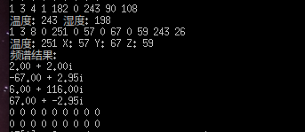

  * 这里有通过mqtt上传数据到客户端实现数据监控。以下是效果【**我未连接开发板，因为展示没有以太网**】TODO

    这里所有数据都是在`Ubuntu下`测试的，同时`开发板`上也是一样的，只是有了数据的读取。

    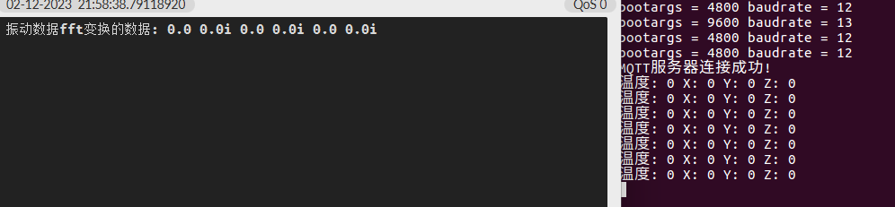

    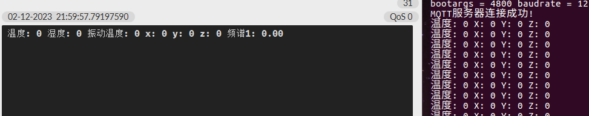


### 11、串口屏显示部分

> 这里使用了串口屏显示。也就是使用RS485->TTL这样的一个转换。TODO【考完试后2023.12.1】由于rs232->模块还没到，所以暂时无法使用这个串口屏进行本地显示。


### 12、展示成果的时刻到了-> 😁😁

> 接收**COM口** 函数设计

**①接收COM口数据测试** 

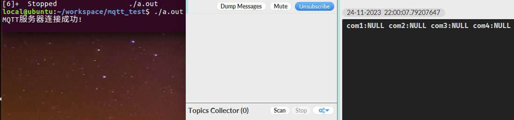

**②服务器端发送数据 客户端订阅消息回调函数执行** 

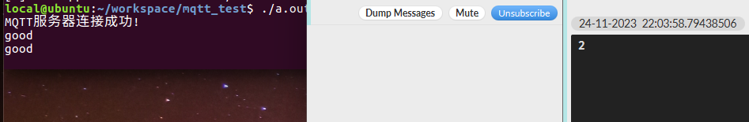

**③详细请查阅[中间件->源码，请点击](./src/temp.c)** 【2023.11.24】TODO

**④温湿度传感器展示读取`COM口`** 【2023.11.27】TODO

> 注: 这里我并没有连以太网，若要进行MQTT远程控制和显示，只需将此网关连接网关即可实现。
>
> 这里的文件是在`/home目录`下的 **a.out**  可执行文件

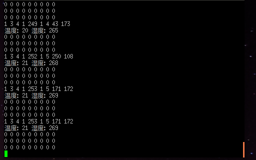

**⑤振动传感器部分显示** 【2023.12.1】TODO

> 注: 这里有进行 `x, y, z` 轴的**FFT变换** 计算频谱

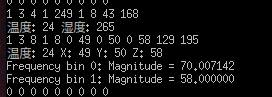


**⑥最终结果展示**


### ⭐⭐其他的后续再补充，有用的话记得点星星⭐~

&nbsp;&nbsp;&nbsp;&nbsp;&nbsp;&nbsp;&nbsp;&nbsp;&nbsp;&nbsp;&nbsp;&nbsp;&nbsp;&nbsp;&nbsp;	&nbsp;&nbsp;&nbsp;&nbsp;&nbsp;&nbsp;&nbsp;&nbsp;&nbsp;&nbsp;&nbsp;&nbsp;&nbsp;&nbsp;&nbsp;&nbsp;&nbsp;&nbsp;&nbsp;&nbsp;&nbsp;&nbsp;&nbsp;&nbsp;&nbsp;&nbsp;&nbsp;&nbsp;&nbsp;&nbsp;&nbsp;&nbsp;&nbsp;&nbsp;&nbsp;&nbsp;&nbsp;&nbsp;&nbsp;&nbsp;&nbsp;&nbsp;&nbsp;&nbsp;&nbsp;&nbsp;&nbsp;&nbsp;&nbsp;&nbsp;&nbsp;&nbsp;&nbsp;&nbsp;&nbsp;&nbsp;&nbsp;&nbsp;&nbsp;&nbsp;&nbsp;&nbsp;&nbsp;&nbsp;&nbsp;&nbsp;&nbsp;&nbsp;&nbsp;&nbsp;&nbsp;&nbsp;&nbsp;&nbsp;&nbsp;&nbsp;&nbsp;&nbsp;&nbsp;&nbsp;&nbsp;&nbsp;&nbsp;&nbsp;&nbsp;&nbsp;&nbsp;&nbsp;&nbsp;&nbsp;&nbsp;&nbsp;&nbsp;&nbsp;&nbsp;&nbsp;&nbsp;&nbsp;&nbsp;&nbsp;&nbsp;&nbsp;&nbsp;&nbsp;&nbsp;&nbsp;&nbsp;&nbsp;&nbsp;&nbsp;&nbsp;&nbsp;&nbsp;&nbsp;**`->AUTHOR: Brainy`** 

